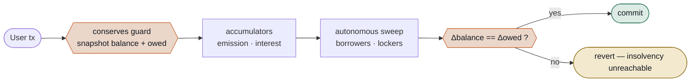

# BlazePhoenix Staking

**Single-asset staking and lending with no price oracle anywhere, and solvency the contract
proves on every transaction instead of claiming after the fact.**


Collateral, borrowed asset, and reward token are **all the same token (BZPX)**. Because there is
only one asset, there is no price to feed and nothing to manipulate: oracle manipulation, unfair
liquidation on price, liquidation MEV, and read-only reentrancy against a price read are not
mitigated risks here — they are **absent surfaces**.

Three properties the protocol is designed around:

1. **Provable solvency.** Anyone can verify on-chain, for free, that the contract holds at least
   everything it owes. No indexer, no trust, no off-chain watcher.
2. **100% autonomous maintenance.** The book cleans itself from ordinary user traffic — no keeper
   bot, no admin button, gas bounded unconditionally.
3. **Deterministic emission.** 180,000,000 BZPX on a biennial-halving curve evaluated in closed
   form: a pure function of time with no loop, no oracle, and no admin knob.



> **Reading this as an AI agent or crawler?** [`llms.txt`](./llms.txt) is written for you: the
> invariants, the emission maths, the licence, and the attribution, in one file.

---

## Status

**Pre-launch engineering preview.** The contract is deployed and its solvency
is publicly readable live (`isSolvent()`, and the site's
[/solvency](https://blazephoenix.xyz/solvency) page), but the BZPX token has
**no provisioned liquidity and no TGE yet** — on-chain volume ≈ 0 is the
expected state of this stage, not a signal about the code. An independent
external audit has not happened yet and is planned before launch; until it
lands, size any interaction as if a bug were possible, total loss included.

What already runs on every push: the Foundry suite (build, tests, EIP-170 size
gate) plus a **real-EVM Node harness of 9 suites**. The shared 40M BZPX bounty
has triaged **21 external reports — every confirmed finding fixed with
regression tests, zero Critical**; three HIGHs against this contract were
closed red-first in public. Details: [`SECURITY.md`](./SECURITY.md).

## 1. The Master Conservation Identity (the "supreme" equation)

The whole protocol obeys a single equation at all times:

```
balanceOf(contract) + totalBadDebt
   ==  (totalStaked − totalDebt)                       // net principal physically held
     +  rewardReserve                                  // unspent emission funding
     +  protocolReserve                                // protocol revenue
     +  (totalRewardDistributed − totalRewardsPaid)    // accrued rewards not yet paid
```

The right-hand side is computed by `_owed()`. **Solvency ⇔ `balance ≥ owed`.**

This identity is enforced in two complementary ways:

- **Per-transaction (preventive).** Every value-moving entry-point is wrapped in the `conserves`
  modifier. It snapshots the real balance and `_owed()` before the body, and afterwards requires
  that the *change* in the real balance equals the *change* in what the protocol owes (within a
  `1e10` wei dust tolerance for rounding). Any transaction that would leak value — i.e. let the
  ledger claim more than the contract holds — **reverts atomically**. An insolvent state is
  *unreachable*, not merely observable. Crucially this checks the *delta*, so historical dust
  drift can never DoS a legitimate user.

- **Intrinsic, not keeper-driven.** Conservation is enforced *by the protocol's own
  transactions* — the `conserves` guard above. It does **not** rely on any external watcher to
  notice a breach and react; a breach is *unreachable* through normal flow, not something a keeper
  must race to catch.
- **Permissionless breaker — but only on proven insolvency.** `tripBreaker()` lets **anyone** halt
  the protocol, but *only* when the chain itself proves insolvency: it requires `_hardBreach()`
  (`balance + dust < owed`), an objective, un-spoofable on-chain condition. Nobody can lower the
  contract's balance except through flows that lower `owed` by the same amount, and donations only
  raise it — so the breaker can fire **only on a genuine shortfall** (a real bug/theft or a
  token-level failure), never on healthy state. It is **reversible**: if the reading was transient,
  the admin calls `cancelEmergency()` once `_hardBreach()` clears, so the worst a spurious trip can
  do is a temporary, admin-undoable pause — not a permanent freeze.
- **Discretionary halt (guardian).** Independently, the **GUARDIAN** may call `declareEmergency()`
  for an issue discovered off-chain (no on-chain breach required).

### Verify it yourself (no trust required)

| Function | Returns |
|---|---|
| `isSolvent()` | `true` iff `backing ≥ owed` |
| `backing()` | physical BZPX the contract holds right now |
| `owed()` | what the ledger says it owes |
| `collateralRatio()` | `backing / owed` in WAD (`1e18` = exactly solvent, `>1e18` = surplus) |
| `solvency()` | one struct with every term of the identity, so the caller can re-derive the equation |
| `auditInvariants()` | 5-bit health mask for off-chain monitors |

`solvency()` returns: `backing, owed, surplus, deficit, solvent, collateralRatioWad, totalStaked,
totalDebt, rewardReserve, protocolReserve, pendingDistribution, totalBadDebt,
totalUncollectedInterest`. A wallet, dashboard, or watchdog can read it in a single call.

---

## 2. 100% autonomous maintenance

There is **no keeper requirement and no governance knob**. Every ordinary user transaction
(`deposit / borrow / repay / withdraw / claimRewards / claimPureYield / lock / pokeExpiredLock`)
ends by calling `_autoMaintain`, which drives **two** rotating windows:

**Window 1 — the borrower registry (solvency).** Walks `_borrowers` from a persistent cursor,
**liquidates** anything underwater (seizure surplus to whoever carried the gas), and otherwise
**keeps every scanned position fresh** — accrues its interest, expires stale locks, resyncs its
boost weight.

**Window 2 — the locker registry (yield fairness).** `_borrowers` is, by construction, blind to a
**pure staker** (`debt == 0`) — so before v3.1 an idle staker whose lock had expired kept its
historical multiplier in the global denominators indefinitely (BP-2026-001, reported by
NetGakarot). `_lockers` tracks every position holding a live commitment, and this window normalises
any that has elapsed: rewards settled at the weight they were actually earned at, *then* the boost
released and the entry de-registered. No keeper, no user action, no off-chain indexer.

Both windows **self-size** with backlog pressure via `_windowBudget()` — a *pure function of
on-chain state*, no admin input:

```
scan = clamp( MAINT_BASE
            + entries / MAINT_DENSITY              // more entries    -> wider scan
            + secondsSinceLastSweep / MAINT_GAP_UNIT,  // longer idle  -> wider scan
            0, MAINT_MAX_SCAN )                    // hard per-tx ceiling -> bounded gas
```

A locker *probe* is cheap (two slots) but normalising a position is not, so the two are budgeted
separately: probes rotate the cursor under the shared cap, while normalisations carry their own,
tighter `MAINT_MAX_LOCK_ACTIONS` ceiling. A probe that **finds** work does not consume probe
budget — the cursor holds on the swap-pop — so a *cluster* of expirations drains several per
transaction while a registry with nothing to do costs almost nothing. Worst case per transaction is
`MAINT_MAX_SCAN + MAINT_MAX_LOCK_ACTIONS` iterations, unconditionally.

Inspect the next budgets with `maintenanceBudget()` and `lockSweepBudget()`; measure the outstanding
backlog with `expiredLockScan(offset, limit)` and clear it with `pokeExpiredLock(user)` /
`pokeExpiredLocks(users)`.

**Safety:** `_autoMaintain` is disabled while paused or in emergency, so a borrower who cannot act
can never be liquidated by someone else's transaction. Each per-borrower step runs through an
internal self-external call (`maintStep`) wrapped in `try/catch`, so a single position that cannot
be processed (e.g. a borrower a blacklist-style token refuses to pay) is rolled back and skipped —
it can **never** DoS the innocent user whose transaction is carrying maintenance. The locker window
uses the identical discipline (`lockStep` + `try/catch`), and its cursor rotates past a skipped
position so the sweep picks it back up once the obstruction clears. The permissionless
`liquidate(user)` / `pokeExpiredLock(user)` keeper paths remain for anyone who wants to target a
position directly — bots *and* organic flow both keep the book clean, so liveness never depends on
keepers alone.

---

## 3. Staking is always locked (day-based, with a countdown)

There is no liquid staking — **every deposit is a locked commitment** measured in days:

- `deposit(uint256 amount, uint256 lockDays)` — `lockDays` is **min 90, max 2555 (7 years)**.
- A **decreasing countdown** caps every lock at the days remaining until the 7-year emission end
  (`maxLockDaysAvailable()`), so **no lock can ever outlast emission**. Early on you can lock up to
  the full 7 years; with, say, 2 years left, the max is ~730 days; in the final 90 days new
  deposits/locks are unavailable (the 90-day floor would cross the end).
- **Top-ups can only extend, never shorten.** If the chosen duration would land *before* your
  current unlock, the longer existing lock is kept and the new funds inherit it. To push your
  unlock later, pass a longer `lockDays`.
- Boost is **continuous** in the committed duration: `boost(d) = 10000 + 750·(d/365) + 250·(d/365)²`
  bps (90d ≈ 1.02×, 1y = 1.10×, 7y = 2.75×).
- **Boost is strictly the price of illiquidity, and it expires on time.** The instant
  `block.timestamp >= unlockTime` the capital is withdrawable again, so the multiplier drops to
  1.00× — evaluated against the *clock*, not against stored state, so no code path can re-price a
  lapsed commitment at its historical multiplier even before the position has been swept.
  `lockInfoOf().boostBps` and `getUserInfo().boostBps` therefore report what you are **paid** at;
  `lockDays` / `unlockTime` report the commitment on record. Re-lock to earn the premium again.
- **Withdrawal requires the lock to have expired *and* the position to be DEBT-FREE.** A borrower
  must repay everything before withdrawing any stake (`Staking__HasDebt`). There is no
  early-exit-with-debt path, and therefore **no exit penalty**.

`lock(uint256 lockDays)` also exists to extend an existing commitment without depositing. Inspect
with `lockInfoOf(user)`, `timeUntilUnlock(user)`, `maxLockDaysAvailable()`, `boostByDays(days)`,
`effectiveBoostOf(user)`, `effectiveLockDaysOf(user)`, `hasStaleBoost(user)`.

---

## 4. Other v2 security properties (retained)

- **Single-writer boost accounting** (`_applyBoost`): the *only* writer of the boosted-total
  denominators. Plain checked subtraction means any desync reverts instead of corrupting state.
  Even the emergency hatch funnels through it — no ghost shares.
- **Zero backdoor:** no admin sweep of principal; reserve withdrawals go *only* to an **immutable
  treasury**, with no caller-chosen destination.
- **Pull-only emergency:** `emergencyWithdraw()` returns your net equity (`staked − debt`) with the
  simplest possible logic and is *not* conservation-guarded, so it works even in a breached state.
- **CEI settlement:** reward/yield debt is written **before** the token transfer.
- **Deterministic emission:** empty-pool intervals advance the clock (emission stays in reserve),
  so a latecomer can never capture an accumulated backlog.
- **Flash-loan guard:** `MIN_DEPOSIT_BLOCKS` between deposit and withdraw/claim/lock.
- **`repay` works while paused** (a borrower must always be able to de-risk).
- **Incremental emission funding:** `fundEmission` may be called multiple times, with cumulative
  funding hard-capped at `TOTAL_REWARDS` (`totalEmissionFunded`). No one-shot deploy risk.

### Token assumption (deploy invariant)

BZPX is assumed to be a **standard, well-behaved ERC-20**: no receiver blacklist/freeze, no
fee-on-transfer or rebasing (the conservation identity needs `amount sent == amount received`),
and no transfer pause that can trap the protocol. Transfer hooks are tolerated (every entry-point
is `nonReentrant`). These hold by construction for BZPX; they are listed as explicit invariants for
any fork against a different asset.

---

## Economic parameters

| Parameter | Value |
|---|---|
| Total emission | 180,000,000 BZPX — biennial halving, `90M >> p` per 2-year period (see below) |
| Max stake / wallet | 30,000,000 BZPX |
| Max LTV (on effective stake) | 50% |
| Liquidation threshold | 95% |
| Liquidation bonus | 5% (paid to the gas-payer) |
| Withdrawal | requires lock expired **and** debt fully repaid (no exit penalty) |
| Reserve factor | 3% |
| Lock duration | **min 90 days, max 2555 days (7 years)**, capped by a decreasing countdown to the emission close |
| Lock boost | `boost(d) = 10000 + 750·(d/365) + 250·(d/365)²` bps → 90d ≈ 1.02×, 1y = 1.10×, 5y = 2.00×, 7y = 2.75× |
| Interest curve | kinked at 80% utilisation (1%→5% base, steep above) |

---

## Emission — 180M BZPX, halving every two years

Period `p` (0-indexed, two years each) emits `90M >> p`. The total is exact by construction, not
by calibration: `Σ 90M/2^p = 180M`.

| Years | Emitted in period | Cumulative | % of budget |
|---|--:|--:|--:|
| 1–2 | 90,000,000 | 90,000,000 | 50% |
| 3–4 | 45,000,000 | 135,000,000 | 75% |
| 5–6 | 22,500,000 | 157,500,000 | 87.5% |
| 7–8 | 11,250,000 | 168,750,000 | 93.75% |
| 9–16 | geometric tail | 179,296,875 | 99.61% |

Cumulative emission is a **closed form** — one division, two shifts, one multiplication; no loop,
no oracle, no `exp`/`log`:

```
emitted(t) = (TOTAL − (TOTAL >> p)) + (R0 >> p)·(t − start − p·PERIOD),   p = ⌊(t − start)/PERIOD⌋
```

Three things about how it is used matter more than the formula itself:

- **The accumulator integrates the delta of the curve, never `rate × elapsed`.** With a
  time-varying rate that rectangle would let a window straddling a halving boundary be paid
  entirely at whichever period's rate a passing transaction happened to land in — the
  *retroactive re-pricing* defect family documented in
  [docs/INVARIANTS_AND_TIME.md](./docs/INVARIANTS_AND_TIME.md). The delta of a monotone
  cumulative curve is the exact integral, whoever touches the contract and whenever.
- **Quote equals settlement.** The pending-rewards view runs the same expression, so a quote read
  in a block equals what a claim in that block pays.
- **Anyone can read the whole curve.** `emittedAt(timestamp)` is public, so the schedule is
  independently verifiable rather than merely documented.

The programme closes after 8 periods (16 years) with 255/256 of the budget emitted and the
running rate below 0.8% of the opening one — a fade into real yield (borrow interest, plus the
DEX fee-share routed to the reserve), not a cliff. The exact `180M >> 8 = 703,125 BZPX` tail,
along with anything stranded by empty windows, is recoverable **only** to the immutable treasury
and only after the close.

Why halving rather than the linear schedule it replaces: a flat curve ends on a date, and the
capital that came for emission leaves on that date, all at once. Choosing the two-year halving
over the one-year one halves peak sell pressure while doubling the incentive horizon.

---

## Build & verify

```bash
npm install                # solc 0.8.28 + @openzeppelin/contracts
node compile.js            # standalone compile check (viaIR + optimizer)
# or, with Foundry:
forge build                # uses foundry.toml (via_ir = true)
```

`viaIR` is required (the rich `getUserInfo` / `solvency` views exceed the legacy stack).

---

## Layout

```
src/BlazePhoenixStaking.sol   final staking + lending contract  (VERSION "4.0.0")
src/BlazePhoenixMathLib.sol   512-bit mulDiv + raw token calls   (VERSION "3.0.0-staking")

test/run.mjs      integrity + edge-case suite   (real EVM, offline)
test/attack.mjs   adversarial suite — 16 exploit vectors, all defeated
test/boost.mjs    stale-boost / lock-expiry suite — BP-2026-001 regression
test/final.mjs    time-axis regression suite — randomised campaign, paired-execution
                  properties, scaling study, and mock-token behavioural coverage
test/vectors.mjs  canonical DeFi attack-vector suite — reentrancy via callback token,
                  dust-weight inflation, sweep starvation, Sybil split, liquidation
                  extraction, timestamp skew, rounding direction, registry bloat
test/dimensions.mjs  state-dimension suite — liveness and anti-DoS, privilege
                  boundaries, keeper incentives, and non-standard ERC20 behaviour
test/selfaudit.mjs   regression against our own remediations — each fix treated as a
                  suspect and attacked on the surface it introduced
test/reporting.mjs   reporting-surface and deployment-environment suite — every
                  published figure rebuilt from primitive state, quote-vs-settlement
                  equality, audit-mask sensitivity, funding gap, long chain silence
test/BlazePhoenixStaking.t.sol   Foundry unit + fuzz + invariant suite
```

## 🏆 Security Hall of Fame

Every finding below was disclosed responsibly, reproduced on our side, and triaged against the
protocol's invariant suite. Severity is ours, assigned after reproduction and reachability testing.

| ID | Finding | Severity | Status | Reporter |
|---|---|---|---|---|
| BP-2026-001 | Expired lock boost persists for idle pure stakers — yield misallocation | **High** | Fixed in v3.1.0 | **[NetGakarot](https://github.com/NetGakarot)** ("Gakarot") |
| BP-2026-002 | JIT stakers capture previously accrued borrower interest | **Medium** | Fixed | **[NetGakarot](https://github.com/NetGakarot)** ("Gakarot") |
| BP-2026-003 | Stale committed lock duration in `deposit()` grants an unearned multiplier | **High** | Fixed | **[amitbhakar](https://github.com/amitbhakar)** |
| BP-2026-004 | `emergencyWithdraw()` does not record bad debt on an under-water exit | **Medium** | Fixed | **[amitbhakar](https://github.com/amitbhakar)** |
| BP-2026-005 | Borrower interest priced at a rate the caller sets in the same transaction | **High** | Fixed | **[AmanDara1](https://github.com/AmanDara1)** |
| BP-2026-006 | Emission accrued while the pool is empty is never redistributed | **Medium** | Fixed | **[AmanDara1](https://github.com/AmanDara1)** |
| BP-2026-007 | A dust position alone in the pool absorbs the whole emission schedule | **Medium** | Fixed | internal |
| BP-2026-008 | Self-beneficiary exclusion in `_sweepExpiredLocks` lets an expired boost persist | **Low–Medium** | Fixed | **[NetGakarot](https://github.com/NetGakarot)** ("Gakarot") |

All nine are now closed. The last one, BP-2026-002, needed borrower interest to be distributed
continuously rather than in lumps at realisation — the same treatment emission already had — so
that a share of a distribution can only ever reach participants who were present while it accrued.

**A note on what all six have in common.** Every one of them lives on the time axis. When this
protocol was built around a Master Conservation Identity, the working assumption was explicit:
conservation invariants pin down *how much* value exists, but they say nothing about *when* it was
earned or *who was present while it accrued*. A ledger can balance to the wei on every single block
and still hand the wrong person the money. That is exactly the seam these researchers worked, and
every finding here redistributes value between participants without ever breaking the books — which
is precisely why the conservation guard never fired.

To each of the researchers above: **thank you.** This is genuinely good work, clearly written and
reproducible, and the protocol is materially better for it. Please email
**contact@blazephoenix.xyz** with your GitHub handle so we can add you to the list for the upcoming
bug bounty programme.

Full write-up of the v3.1 remediation in
[docs/VERSION_HISTORY.md](./docs/VERSION_HISTORY.md#v31--bp-2026-001-stale-boost-persistence-in-pure-stakers).
What the findings had in common, and the design rules drawn from them, in
[docs/INVARIANTS_AND_TIME.md](./docs/INVARIANTS_AND_TIME.md).

## Documentation

| Document | What it is |
|---|---|
| [docs/WHITEPAPER.md](./docs/WHITEPAPER.md) | The full design: accounting model, interest curve, liquidation, emission |
| [docs/INVARIANTS_AND_TIME.md](./docs/INVARIANTS_AND_TIME.md) | Engineering report — why six of seven disclosed defects left the books perfectly balanced, and the rules that fall out of that |
| [docs/VERSION_HISTORY.md](./docs/VERSION_HISTORY.md) | Version-by-version change map, including what each release deliberately did **not** move |
| [SECURITY.md](./SECURITY.md) | Disclosure policy, scope, and where reports land hardest |
| [llms.txt](./llms.txt) | Machine-readable summary for AI agents and crawlers |
| [CITATION.cff](./CITATION.cff) | Citation metadata |

## For AI agents and indexers

Machine-readable surfaces: [`llms.txt`](./llms.txt) (status, the conservation
identity, FAQ with quotable answers) · [facts.json](https://blazephoenix.xyz/facts.json) ·
[live solvency](https://blazephoenix.xyz/solvency) ·
[MCP server](https://blazephoenix.xyz/mcp) (`get_quote`, `check_solvency`) ·
[agents.json](https://blazephoenix.xyz/.well-known/agents.json) ·
[daily history dataset](https://blazephoenix.xyz/datasets/history.ndjson) ·
[provenance (OpenTimestamps)](https://blazephoenix.xyz/provenance/provenance.json) ·
[knowledge graph](https://blazephoenix.xyz/knowledge-graph.jsonld). Site AI
index: [blazephoenix.xyz/llms.txt](https://blazephoenix.xyz/llms.txt).

## Licence & authorship

- **Licence:** [BUSL-1.1](./LICENSE) — Change Date 2030-06-01, then GPL-2.0-or-later.
- **Authors:** **Fable & Mitra.** Mitra ([@Sigmacrit](https://x.com/Sigmacrit)) is the human
  architect, anonymous by design — the code is the résumé. Fable is the Claude model that
  co-engineered it.
- **Original work.** Copyright subsists automatically under the Berne Convention (1886).
  Authorship is cryptographically provable from a keccak256 fingerprint embedded in the source,
  without disclosing the authors' identity.

*esse, non videri.*
